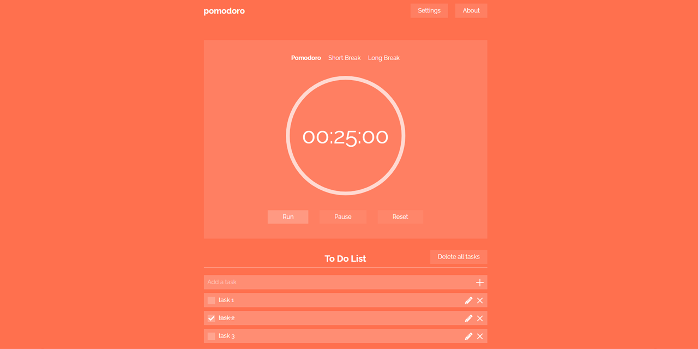

# Pomodoro
 
This is a time managment tool for using Pomodoro Technique (Web-application).

# Featues:

- Сhoice of mode - pomodoro, short break or long break with different backgroung colors
- Configurable time for modes
- Notification sound at the end of the timer
- On/off notification sound in settings
- To do list with adding/editing/saving tasks
- Your tasks and settings are saved to localStorage after page refresh
- Simple minimalistic design
- Adaptive version of design for mobile
